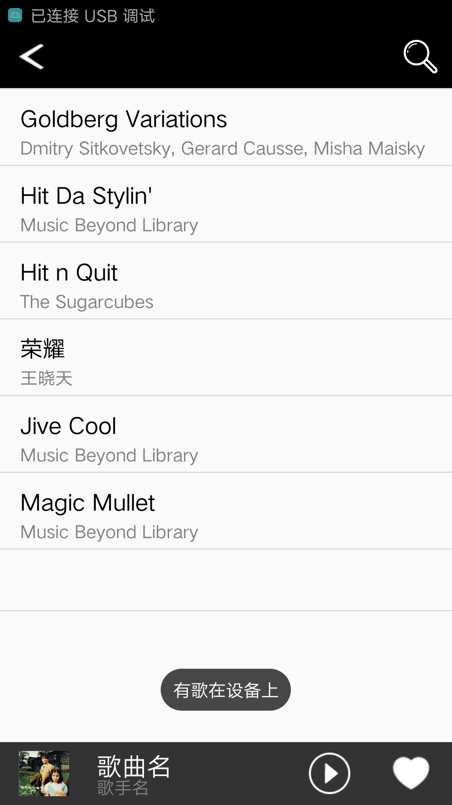

# BogeMusic
基于MVP模式的音乐播放器，可以用来学习mvp模式和MediaPlayer

有几个界面没用presenter来控制逻辑，歌词界面把情非得已写死了（有请求入口，用TODO标记了），歌曲是陈洁丽的，可以下载下来播放看歌词显示效果

------

-------

感谢[设计豆](http://www.zcool.com.cn/u/15006487)设计美化

个人博客：[简书](http://www.jianshu.com/u/43a04ef9d4c6)
